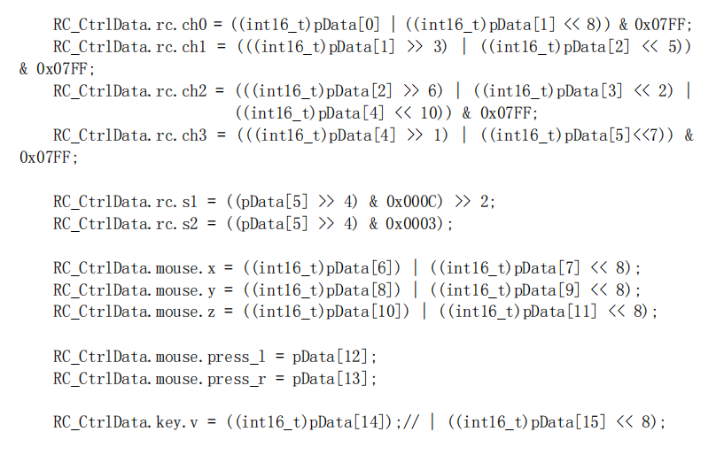

# DBUS

1.通信接口：USART（TTL）   

2.通信参数：1个起始位+8个数据位+偶校验+1个停止位，波特率=100kbit/s,电平逻辑反转 

3.数据帧格式：一帧数据的长度为18字节，一共144位。 

必须使用硬件取反，软件不行 

解析数据

      

## 在DT7遥控器中，DBUS与SBUS对数据的解析拼接方式大致相同，SBUS第一位是帧头，不要放进通道一里，应从第二位开始拼接。

## 通道0，1，2，3后是s1,s2,鼠标xyz轴，鼠标左右键；修改时要找到对应通道

# SBUS

1.通信接口：USART（TTL) 
2.通信参数：1个起始位+8个数据位+偶校验+2个停止位，波特率=100000bit/s，电平逻辑反转。 
3.通信速率：每14ms（模拟模式）或7ms（高速模式）发送，即数据帧间隔为11ms（模拟模式）或4ms（高速模式）。 
4.数据帧格式：

首部（1字节）+ 数据（22字节）+ 标志位（1字节）+ 结束符（1字节） ## 首部：起始字节 =0000 1111b （0x0f） 
数据：22 字节的数据，分别代表16个通道的数据，也即是每个通道的值用了 11 位来表示，22x8/16 = 11每个通道的取值范围为 0~2047，低位在前、高位在后 
标志位：1字节 

高四位从高到低依次表示： 
bit7：CH17数字通道 
bit6：CH16数字通道 
bit5：帧丢失(Frame lost) 
bit4：安全保护(Failsafe)：失控保护激活位(0x10）判断飞机是否失控 
bit3~bit0：低四位不用 ## 结束符：0x00 必须使用硬件取反，软件不行 

解析数据

# 遥控器替换 

1.大疆DT7替换为乐迪AT9s Pro ,将乐迪R9DS接收器切换为SBUS十通道模式，同时乐迪AT9s Pro也切换为多旋翼模式和十通道模式    

2.若要传输摇杆和键鼠全部数据需要十二通道，R9DS切换为SBUS模式下只支持十通道，强行使用会导致通道数据错误跳变    

3.自行设置乐迪AT9s Pro的按键通道映射功能

4.乐迪AT9s Pro疑似不支持USB连接电脑进行键鼠操控，故上述操作未使用R12DS接收器与乐迪AT9s Pro的十二通道 

5.因为硬件原因，大疆DT7的滚轮无法在乐迪AT9s Pro上复现

